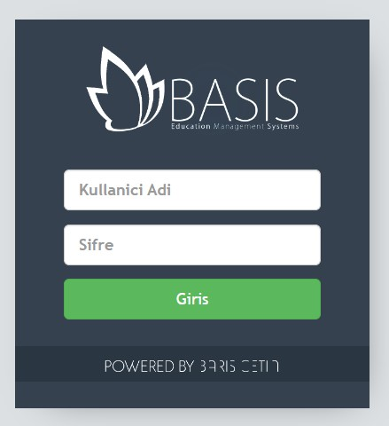
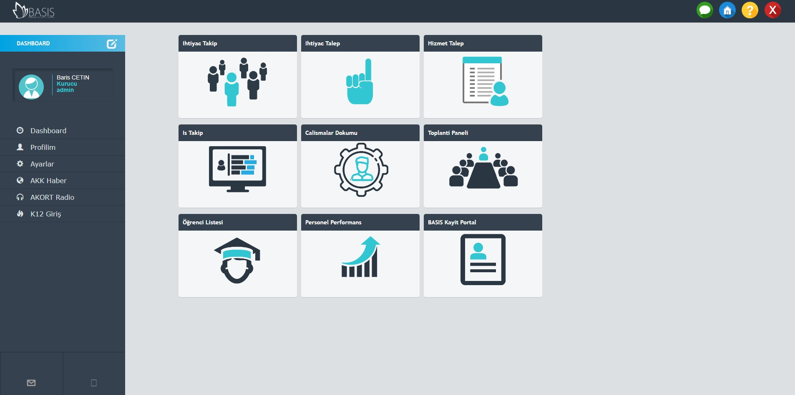
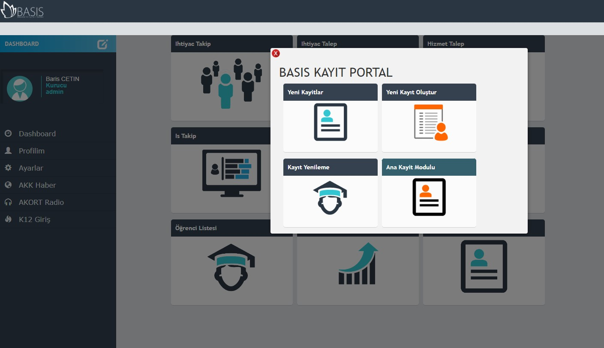
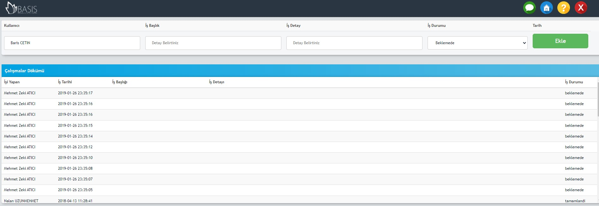

# Basis-ERP

BASIS is a free to use Resource Management Software developed by Barış Çetin

This web application has a authoristaion based modular access that you can set limitations for each individuals role as
Founder, Admin, Principal, Teacher, Student and decide which group will access which module by defining role clearence level.

#Features

 - Log-in authentication.
 - Mysqli database.
 - user configuration (add,delete,modify user).
 - User task assignment module.
 - Student registration and management module.
 - Detailed task module that includes deadline, task details, file attachments.
 - service request module (users can request a service from desired branch).
 - users can create, make payment adjustments and appointments for parents.

Login Screen 

Dashboard

Student registration module 

Task module 

////////////////////////////////////////////////////////////////////////////////////

INSTALLATION

upload files to your server or localhost
create istech.sql database using phpmyadmin
you can modify server authentication settings using config.php file

///////////////////////////////////////////////////////////////////////////////////

exemplary database included "istech.sql", you can use same table structure

Freelicence - feel free to develop further - adding me as author would be more than enough

Barış ÇETİN
